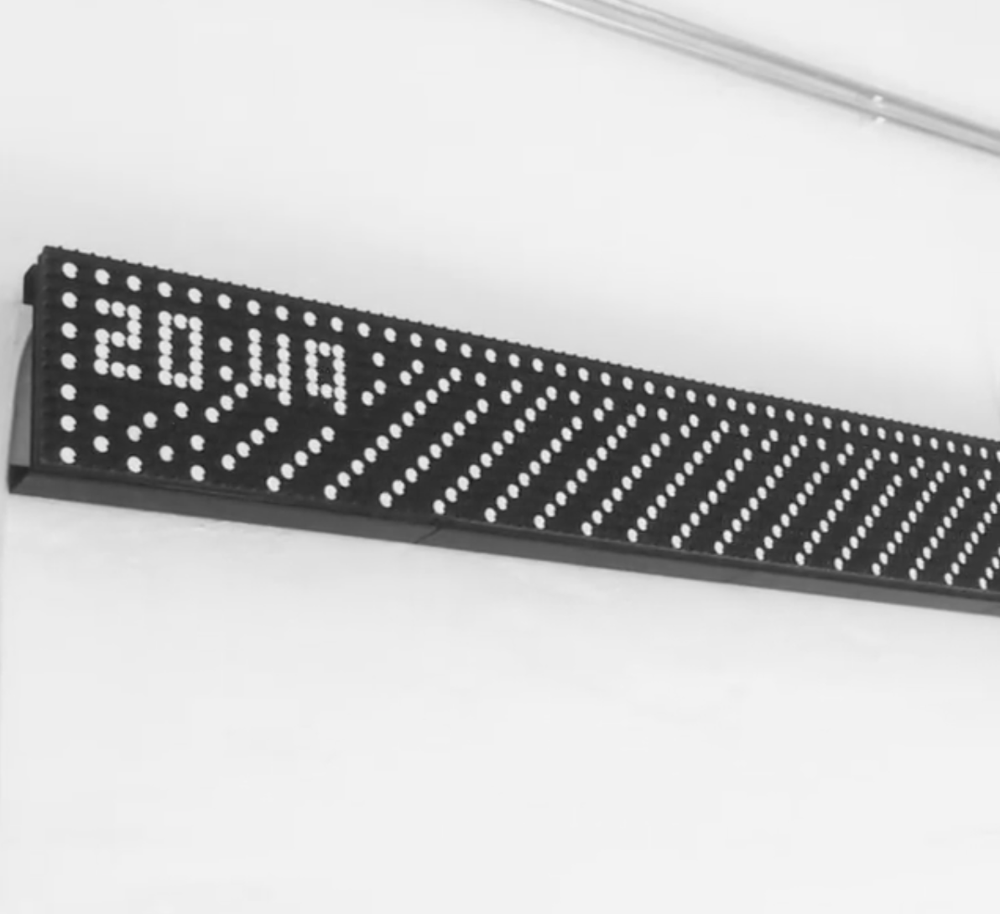

# Processing Flipdots Controller
Small implentation of controlling your AlfaZeta Flipdots OTA:
- Generate a PImage / PGraphics
- Convert it into a bytestream
- Send via UDP (in times of corona it is important to not shake hands!)

