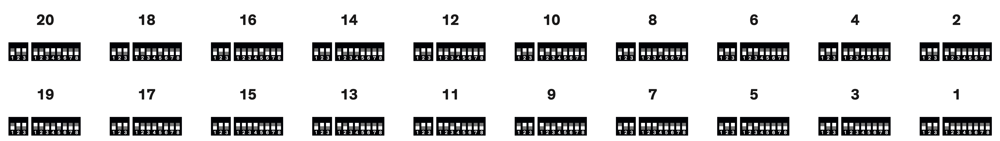

[](http://processing.org/)
[](http://arduino.cc/)


# Flipdots (Flip-dot display or flip-disc display)

Everything you ever wanted to know about Flipdots in one compact repository!

>The flip-disc display (or flip-dot display) is an electromechanical dot matrix display technology used for large outdoor signs, normally those that will be exposed to direct sunlight. Flip-disc technology has been used for destination signs in buses across North America, Europe and Australia, as well as for variable-message signs on highways. It has also been used extensively on public information displays.[1] A few game shows have also used flip-disc displays, including Canadian shows like Just Like Mom, The Joke's on Us and Uh Oh!, but most notably the American game show Family Feud from 1976 to 1995 and its British version Family Fortunes from 1980 to 2003. Polish version of Family Feud, "Familiada", still uses this board, which was bought from the Swedish version of the show.[2]

(Source: https://en.wikipedia.org/wiki/Flip-disc_display)

## Overview
* [General Information](#general)
* [Hardware](#hardware)
* [Protocol](#protocol)
* [Processing Controller](#processing)
* [Arduino](#arduino)

## General

This repository contains all of my findings and explorations in regards with Flipdot displays. All of the examples are based on the XY5 modules sold by [Alfa-Zeta Ltd.](http://www.flipdots.com/), purely for reasons of usability and their electrically certified products.
Please handle your Flipdot displays with care, as electrostatic discharge can damage them permanently!
In order to use the examples on any other boards than XY5 Flipdot modules, you have to modify them on your own!

## Hardware
The hardware is quite simple to use, but it might take a bit to get used to it.
The boards/panels are called "AlfaZeta XY5 Boards" and come in different variations and two dot sizes. The table will help you to see which dot sizes for which grid are available.

| Grid Size | 8.9mm | 13.5mm |
|-----------|-------|--------|
| 14x28     | YES   | YES    |
| 7x28 	    | YES   | YES    |
| 7x14      | NO    | YES    |
| 7x7       | NO    | YES    |
| 7x1       | NO    | YES    |

The following table is for the most standard module, the 14x28 panel:

| | |
|-----------------------------------|------------------------------|
| Supply voltage                    | 24V DC                       |
| Control Interface                 | RS-485 (data source          |
| Speed                             | 15 FPS                       |
| Max. current consumption          | 680mA                        |
| Idle current                      | 40mA                         |
| Energy to swap one complete panel |160ms x 680mA                 |
| Max. voltage                      | 25V DC                       |
| Nominal voltage                   | 24V DC                       |
| Suggested power supplies          | 0.8A per panel at 24V DC     |

The 14x28 panel is physically made of two 7x28 panels soldered onto one pcb but without any electrical connections between them. This is currently also the configuration which allows the fastest refresh rates of the dots.


The module has a front face, where you see the dots flipping, and a backside with the control unit, a 10x10x04 cm printed circuit board which receives signals via RS-485 data line and converts signals into mechanical movements on the XY5 module.

First of all, the controller has different communication speeds. Usually we would put it to the max and match it in our controlling software. In order to do that, we have to set the DIP switch 1 - a small manual electric switch that has three little switches on !

### Available speed of transmission for the controller
1. 9600 bit/s
2. 19200 bit/s
3. 38400 bit/s
4. 57600 bit/s

By setting the switches into an ON or OFF position, we adjust the bit-rate of the controller. The value is the byte representation we are setting with ON/OFF in binary - or basically ones and zeroes:

| Value  | 1 | 2 | 3 | Speed |
|--------|---|---|---|-------|
| 0      |OFF|OFF|OFF| N/A   |
| 1      |ON |OFF|OFF| N/A   |
| 2      |OFF|ON |OFF| N/A   |
| 3      |ON |ON |OFF| 9600  |
| 4      |OFF|OFF|ON | 19200 |
| 5      |ON |OFF|ON | 38400 |
| 6      |OFF|ON |ON | 57600 |
| 7      |ON |ON |ON | 9600  |

Next we have to set the address of the controller. When we are running multiple controllers we don't want them to show all the same content, but map different parts of our content to different panels!
Unfortunately the controllers are not zero-indexed and start their addresses at 1.
To change the address of a controller we need to use the 2nd blue DIP switch with 8 numbers (from 1 to 8) on it.

| Position  | Meaning                          |
|-----------|----------------------------------|
| 1 - 6     | Address in binary code (natural) |
| 7 - 8     | Special test modes               |

In order to set your boards to certain address please have a look at the follwing figure and adjust your DIP switch according to it.


| Value  | 7 | 8 | Effect                                     |
|--------|---|---|--------------------------------------------|
| 0      |OFF|OFF| test mode OFF. normal reception of signals |
| 1      |OFF|ON | all pixels are flipping black/white        |
| 2      |ON |OFF| columens and lines are "moving"            |
| 3      |ON |ON | move one dot                               |

## Protocol
Next we want to talk to the our panels. On the backside we can find a green terminal with the labels "A" and "B" written next to it. This implies, that the data channels A and B from RS-485 go in here.
We grab our Arduino and a MAX RS485 and set it up as a controller, thus making our Flipdot panel a peripheral!
This minimal setup is certainly enough, since the Flipdot panel doesn't talk back to the controller:


In order to send a data frame (that is a complete package with address information, content etc.) we need to learn how to construct it first:

### Data Frame structure
| Header | Command           | Address      | Data              | End byte |
|--------|-------------------|--------------|-------------------|----------|
| 0x80   | Description below | 0x00 - 0xFF* | Description below | 0x8F     |

Addresses are written here in Hexadecimal form.

| Address |                     |
|---------|---------------------|
| 0x00    | Send to ALL panels  |
| 0x01    | Panel 01            |
| 0x02    | Panel 02            |
| 0x03    | Panel 03            |
| 0x04    | Panel 04            |
| 0x05    | Panel 05            |
| 0x06    | Panel 06            |
| 0x07    | Panel 07            |
| 0x08    | Panel 08            |
| 0x09    | Panel 09            |
| 0x0A    | Panel 10            |
| 0x0B    | Panel 11            |
| 0x0C    | Panel 12            |
| 0x0D    | Panel 13            |
| 0x0E    | Panel 14            |
| 0x0F    | Panel 15            |

### Data
MSB is neglected, the following bits B6 - B0 are setting dots from top to bottom respectively.
This means, the data is organized in columns which is typically 7 bits long and has to be packed like that.

### Commands
| Command | Number of data bytes | Automatic refresh | Description |
|---------|----------------------|-------------------|-----------------------------------------------------------------------------------------|
| 0x81    | 112                  | No                | Send one 112 bytes and wait for refresh / One controller + 3 Extensions                 |
| 0x82    | 0                    | Yes               | Refresh the display                                                                     |
| 0x83    | 28                   | Yes               | Send one 28 bytes and refresh the display (14x28 displays with two controllers)         |
| 0x84    | 28                   | No                | Send one 28 bytes and wait for refresh (14x28 displays with two controllers)            |
| 0x85    | 56                   | Yes                | Send one 56 bytes and refresh the display (14x28 displays with two controllers)        |
| 0x86    | 56                   | No                | Send one 56 bytes and wait for refresh (14x28 displays with two controllers)            |

And here is the first example. Let's give a warm Welcome to our first Flipdots panel (Address: 0x01) by erratically flipping the dots from black to white and vice versa:

```c
	byte all_white_2C[] = {0x80, 0x83, 0x01, 0x7F, 0x7F, 0x7F, 0x7F, 0x7F, 0x7F, 0x7F, 0x7F, 0x7F, 0x7F, 0x7F, 0x7F, 0x7F, 0x7F, 0x7F, 0x7F, 0x7F, 0x7F, 0x7F, 0x7F, 0x7F, 0x7F, 0x7F, 0x7F, 0x7F, 0x7F, 0x7F, 0x7F, 0x8F};
	byte all_black_2C[] = {0x80, 0x83, 0x01, 0x00, 0x00, 0x00, 0x00, 0x00, 0x00, 0x00, 0x00, 0x00, 0x00, 0x00, 0x00, 0x00, 0x00, 0x00, 0x00, 0x00, 0x00, 0x00, 0x00, 0x00, 0x00, 0x00, 0x00, 0x00, 0x00, 0x00, 0x00, 0x8F};

	void setup() {
  		Serial.begin(57600);  
	}

	void loop() {
		Serial.write(all_black_2C, 32);
   		delay (200);
  		Serial.write(all_white_2C, 32); 
   		delay (200);
	}
```

Quick explanation to the Serial.write line and the mysterious *32*:
Snce we are sending an Array, we also have to say how many bytes are in there:
- 1 byte for the header (0x80)
- 1 byte for the command (0x83)
- 1 byte for the address (0x01)
- 28 bytes of data (Our rows of Flipdots)
- 1 byte for the end byte to signify the end of our data frame (0x8F)

Great! You've done it.

## Processing


From here on, we could use something like an Arduino that is connected to Computer and receives real-time data from a more dynamic data source such as Processing, PureData, openFrameworks etc.
I am using Processing and have build a rather "general" Flipdot player, that sends out data via Artnet over Ethernet to a Teensy 4.1. This gives me fast speed over long distances.

### Features
- State-machine play modes
- Thread-driven states (eg. "Time" shows every 15 minutes and puts itself on top of the queue)
- Clean packing of the flipdot data
- Dithering
- Automatically imports movies from a footage folder
- Retro User Interface

The Flipdot Player is currently in experimental use at the "Living the City" Exhibition in Berlin, running from *25.9.–20.12.2020 at Tempelhof Airport Platz der Luftbrücke* (Free admission!)
Go and watch it in action there.

